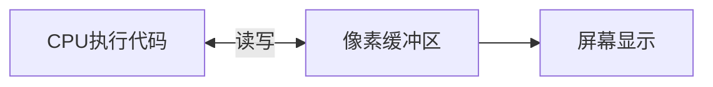
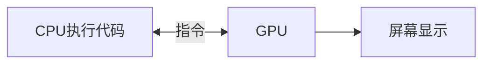
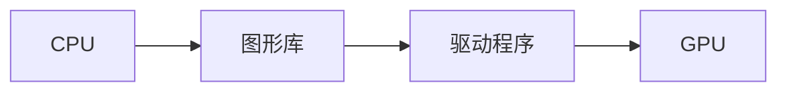
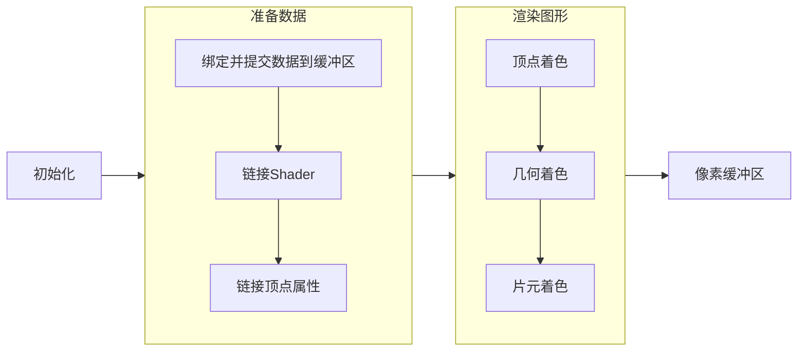

## 屏幕上显示的图像

1. 这里列举 4k 显示器来说（4k 真赞）
2. 刷新一次全屏需要 CPU 计算 `4096*2160=8847360` 800 多万个像素点。再加上 60Hz 刷新率`8847360*60=530851600`，每秒 5 亿多个像素了。
3. 因为系统上有很多任务需要 CPU 执行，忙不过来就会卡顿，为了缓解 CPU 的压力，加入了[图形处理器（GPU)](https://zh.wikipedia.org/wiki/%E5%9C%96%E5%BD%A2%E8%99%95%E7%90%86%E5%99%A8)。

4. 这时 CPU 只用吩咐 GPU 干活，美滋滋。

## 驱动 GPU 工作

我们一般使用一种图形库来工作，常见的如下：

- [OpenGL](https://zh.wikipedia.org/wiki/OpenGL) 多平台支持
  - [OpenGL ES](https://zh.wikipedia.org/wiki/OpenGL_ES) (由上精简出来的移动端版本)
    - [WebGL](https://zh.wikipedia.org/wiki/WebGL) (由上精简出来的网页版本)
- [DirectX](https://zh.wikipedia.org/wiki/DirectX) Windows 专有
- [Metal](<https://zh.wikipedia.org/wiki/Metal_(API)>) macOS 专有
- [Vulkan](https://zh.wikipedia.org/wiki/Vulkan) 未来接替 OpenGL&ES
- [WebGPU](https://zh.wikipedia.org/wiki/WebGPU) 未来接替 WebGL

## 使用 OpenGL

推荐学习读物：

> [learnopengl-cn](https://learnopengl-cn.github.io/)

最基础的工作过程如下：

